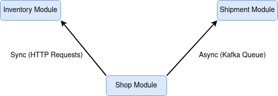

[](https://sonarcloud.io/dashboard?id=teixeira-fernando_EcommerceApp)
[](https://sonarcloud.io/dashboard?id=teixeira-fernando_EcommerceApp)
[](https://sonarcloud.io/dashboard?id=teixeira-fernando_EcommerceApp)

[](https://sonarcloud.io/dashboard?id=teixeira-fernando_EcommerceApp)

# E-commerce App - Microservices Java

## Microservices

* Shop
* Inventory
* Shipment



## Instructions

The docker-compose file contains the pre-requisites to run the application: MongoDB and Kafka

So, first run: 

```
docker-compose up -d
```

Then, you can run the application modules:

Run Inventory:

```
mvn -f inventory/ spring-boot:run 
```

Run Shop:

```
mvn -f shop/ spring-boot:run 
```

Run Shipment:

```
mvn -f shipment/ spring-boot:run 
```


## Instructions for contract tests wth Pact

This project contains contract tests using Pact. In order to run it, first of all you need to bring up the pact broker.
To run the pact-broker using Docker, execute:

``` 
docker-compose up -d
```

Then you can go to the producer module and execute the contract tests, to generate the contracts. The pact files will be
written in the target/pact folder. After that, you can publish the pact into the pact broker with the following command:

``` 
mvn pact:publish (in the shop module)
```

Then you can run the contract tests in the provider side, where it is already configured to get it from the pact broker

``` 
mvn -Dtest=**/contract/** test
``` 

## Other info and Utilities

* Install and activate Intellij plugin to format on IDE:
    * https://plugins.jetbrains.com/plugin/8527-google-java-format

* There is a swagger documentation configured for each module. After running the desired module, you can navigate
  to: http://localhost:{port}/swagger-ui/


* Generate Jars:

``` 
mvn clean install 
```

* Check code Style:

``` 
mvn spotless::check (in the sub-module directory)
```

* Apply code Style:

``` 
mvn spotless::apply (in the sub-module directory)
```